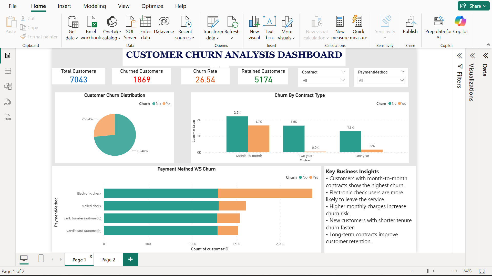
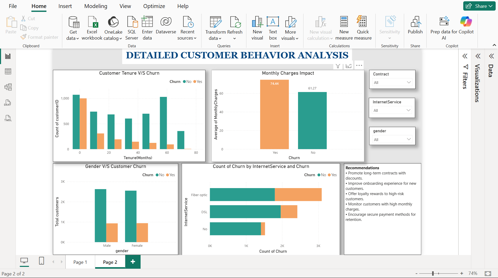

# 📊 End-to-End Customer Churn Analysis
**Combining Python Data Engineering with Power BI Business Intelligence**

## 🎯 Project Objective
The goal of this project is to identify the key drivers of customer attrition (churn) for a telecommunications company. By analyzing customer demographics, account information, and usage patterns, this dashboard provides actionable insights to improve retention strategies.

---

## 🛠️ Project Workflow

### 1. Data Preprocessing (Python)
I used **Google Colab** and **Pandas** to clean and prepare the raw data.
- **Data Cleaning:** Handled missing values in the `Total Charges` column.
- **Feature Engineering:** Created `Tenure Bins` (0-20, 20-40, etc.) to analyze how long-term loyalty affects churn.
- **Exploratory Data Analysis (EDA):** Identified early correlations between contract types and churn rates.

### 2. Data Visualization (Power BI)
I built a 2-page interactive dashboard to tell the data story.
- **KPI Tracking:** Monitored Total Customers, Churn Rate (26.5%), and Retention.
- **Behavioral Analysis:** Visualized how Monthly Charges and Internet Service types impact a customer's decision to leave.
- **Interactive Slicers:** Enabled filtering by Gender, Contract Type, and Payment Method for granular insights.

---

## 📈 Key Business Insights
* **Contract Risk:** Month-to-month contracts show the highest churn volume.
* **Financial Impact:** Customers with "Electronic Check" as a payment method are more likely to leave; moving them to "Automatic Bank Transfer" could reduce churn.
* **Service Gaps:** Fiber Optic customers have higher churn rates despite higher monthly charges, suggesting a need for better service value.

---

## 📂 Project Structure
* [Python Notebook](./Notebooks/) - Contains the data cleaning script.
* [Power BI File](./Dashboard/) - The interactive .pbix dashboard.
* [Dataset](./Data/) - Cleaned CSV used for the analysis.

---

## 🖼️ Dashboard Preview

---

## 📬 Contact
**Geddam Anusha** [https://www.linkedin.com/in/anushageddam/]
